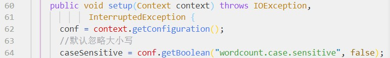
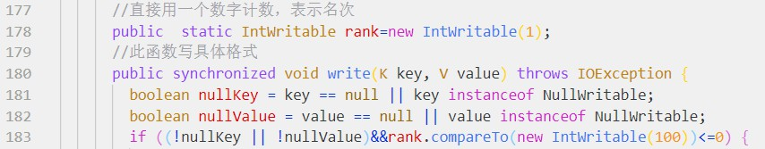
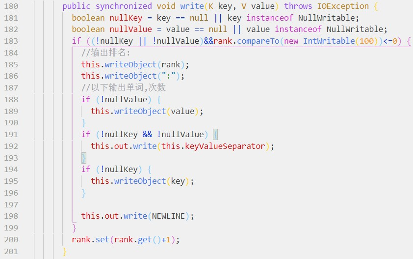

# hw5

## 一、作业要求

在HDFS上加载莎士比亚文集的数据文件（Shakespeare.txt），编写MapReduce程序进行词频统计，并按照单词出现次数从大到小排列，输出前100个高频单词，要求忽略大小写，忽略标点符号（punctuation.txt），忽略停词（stop-word-list），忽略数字，单词长度>=3。输出格式为"<排名>：<单词>，<次数>"，例如：

1: 单词1，次数

2: 单词2，次数

...

100: 单词100，次数

【注】作业提交方式：git仓库地址或者相关文件的zip包

git仓库目录组织建议：

- project name （例如wordcount）

|  +-- src

|  +-- target

|  +-- output

|  |  +-- result (输出结果文件)

|  +-- pom.xml

|  +-- .gitignore（target目录下只保留jar文件，并忽略其它无关文件）

|  +-- readme.md （对设计思路，实验结果等给出说明，并给出提交作业运行成功的WEB页面截图。可以进一步对性能、扩展性等方面存在的不足和可能的改进之处进行分析。）

## 二、设计思路

总体思路:分两个job，job1与WordCount2.0基本相同，负责匹配模式（忽略大小写、忽略停词等）并计数，唯一区别是输出OutputFormatClass改为SequenceFileOutputFormat，这是为了输出中间文件，方便job2的读取。job2负责对job1输出的中间结果进行排序，并按照指定格式输出

以下是两个job的各种类的设定：

### 分析每个功能对应的代码段

#### 忽略大小写

原始的WordCount2.0将大小写敏感值默认置真，我直接将之改为默认置假，即可。

#### 忽略标点和数字

对原始的puctuation.txt做了修改，添加了一行匹配数字的正则表达式，以此做到忽略标点和数字。

#### 忽略停词

由于匹配采用replaceAll，查看源码发现使用正则表达式，故处理英文单词停词表时，需要在前后加入表示单词边界的\b

#### 单词长度>=3

查看源码发现用getLength()函数得到Text类型的长度，直接在map处做限制，这样最大程度减轻job压力。

#### 按词频降序

这个是核心功能之一，比较复杂，一些重点如下：

##### 用中转文件夹存储job1的计数结果

##### job2的mapper使用InverseMapper类，相应对调OutputKeyClass和OutputValueClass

InverseMapper是hadoop自带的类，可以将key和value互换。

##### 排序时的比较类改为自定义的降序比较类

hadoop默认的排序是升序的，这里加个负号，就可以实现降序

#### 取排名前一百的单词

直接用一个static int计数，只在计数<=100的时候予以输出。

#### 按指定格式输出

将OutputFormatClass设置为自定义的OutputFormat，直接修改其中的write函数以实现输出格式的自定义。
## 三、实验结果

运行方式：hadoop jar jar包 输入路径 输出路径 [-skip]，要求punctuation.txt和stop-word-list-txt在当前路径，若不加skip则不忽略标点、停词、数字。

运行结果：

windows的单机成功。

ubuntu的伪分布式成功。

bdkit的集群不成功，但是报错是separator（job2 failed是我在源码中写的，在job2失败时的报错），百度并没有找到答案，怀疑是版本原因，目前未有定论。可以发现，在我多次尝试执行任务后，job总是成功一个失败一个。实际上就是，job1都是成功的，job2都是失败的。

## 四、思考

附带收获：对java代码的理解能力提升。从对java一无所知，到通过OnJava8自学一二，再到对java.lang的常用类和hadoop的常用类具备初步的调用能力，走一步算一步吧。现在我对java的好感度大增，这个语言在面向对象编程方面简直是集大成者，我以前却从未得见。

最大收获：查看源码的能力提升。这个能力不局限于java，其实可以迁移到其他语言上。以前很少有机会涉及大量别人的源码。这次看WordCount2.0的源码，包括过程中一次次查看眼花缭乱的类的源文件，必须感谢IDEA，在查看源码和参数提示方面非常友好。同时，自己的调用和改造代码的能力也算是得到了一点点提升。

但是，与此同时，我发现每次一级级上溯查看hadoop的源码时，常常会触及interface标识的代码。这时就无法再查看下去了，除非去下载hadoop的开源代码。而这些interface代码的扑朔迷离对我的代码改造还是造成了一些小小的麻烦的，所幸后来都想办法绕过了。